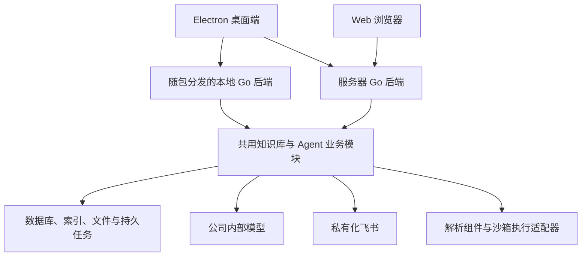

# 轻量部署 AI 知识库助手：能力保留基线

状态：需求访谈中的评审草案。尚未确认最终架构，尚未实现新应用。

参考仓库：Tencent/WeKnora，本地调研提交 `db8e7611be7614e9cf625bea3146ab16a73d58bb`。

## 1. 产品目标与已确认约束

开发一个参考 WeKnora 的独立 AI 知识库助手。保留完整知识工作流和成熟 Agent 机制，降低本地安装、运行和公司服务器部署的复杂度。

- 支持 Windows、macOS Electron 桌面包和 Web 端；两种入口使用同一套业务能力。
- 设置独立 Go 后端服务，优先复用/抽取 WeKnora 的 Go 业务模块，减少重写工作；Electron 负责桌面集成和本地后端生命周期。
- 公司云桌面不能安装 Docker。普通服务器部署也应提供无 Docker 路径；服务器操作系统尚不确定。
- 公司有 npm 镜像，可能有 Go 镜像；最终用户安装运行不应要求现场编译依赖。
- 对接公司内部 LLM、Embedding 和视觉模型。具体接口协议和能力通过适配与连接测试确认。
- 公司有私有化飞书，保留机器人问答与文档/知识空间同步；内部端点可配置。
- 数据源导入、文档入库、检索问答、Agent、LLM Wiki、长期记忆、Skills、MCP、沙箱都是产品范围。
- 明确移除微信小程序，以及 GitLab、Notion、Confluence、语雀、钉钉、RSS、IMA 数据源连接器。其他渠道和适配器先进入能力清单，未经讨论不直接删除。
- 现有 Lite 的启动体验和功能覆盖未满足用户需求。用户没有提供具体错误，不能把某个已发现的代码问题认定为其启动失败根因。

“轻量”的验收维度包括：需要人工安装的组件数量、安装步骤、运行依赖、启动耗时、空闲资源和升级维护成本。Electron 包体积、复杂文档处理内存及沙箱执行环境分别测量，不能笼统承诺全部很小。

## 2. 保留范围与验收契约

以下均为新项目的保留目标，不代表已经实现。来源列描述当前 WeKnora 的参考依据；新项目可以更换实现，但需验证行为。

| ID | 能力 | 保留目标与关键验收 | 参考依据 |
| --- | --- | --- | --- |
| CAP-01 | 数据源导入与同步 | 保留私有化飞书云盘/知识空间同步；连接测试、资源选择、首次全量与后续增量、定时/手动同步、暂停恢复、游标、失败重试和日志。完整列举失败不得把缺失资源当作已删除；失败文档不得推进成功游标。按连接器能力处理源端删除。已明确排除的七类连接器不迁入新项目。 | [数据源说明](../../website-docs/03-features/10-datasource.md)、[飞书连接器实现](../../internal/datasource/connector/feishu) |
| CAP-02 | 文档入库 | 文件/文件夹上传、URL 导入、手工内容、批量处理；校验、原文存储、去重策略、解析、分块、索引、增强任务及状态展示。失败和重启后有可解释的恢复/重试路径。 | [知识库](../../website-docs/03-features/02-knowledge-base.md)、[文档解析](../../website-docs/03-features/03-document-parsing.md) |
| CAP-03 | 多格式与多模态 | PDF、扫描 PDF、Word、Excel、PPT、图片、Markdown/TXT/CSV/JSON 为验收重点。现代 Office 与旧版二进制格式分别提供样本测试；OCR/视觉描述关联原图与来源。现有其他格式逐项登记兼容状态。 | [文档解析](../../website-docs/03-features/03-document-parsing.md)、[解析引擎](../../internal/infrastructure/docparser) |
| CAP-04 | 知识组织与可编辑内容 | 文档/FAQ/Wiki 知识库、目录树、标签、元数据、批量操作、分块预览/编辑/版本回滚、重新解析及索引更新。原文、编辑内容和索引版本应可核对。 | [知识库](../../website-docs/03-features/02-knowledge-base.md)、[分块](../../website-docs/03-features/04-chunking.md)、[FAQ](../../website-docs/03-features/17-faq.md) |
| CAP-05 | 检索与 RAG | 关键词、向量、混合检索、父子分块、重排、范围过滤、多库检索、问题理解、流式回答与原文引用。记录向量模型/维度；更换模型需重建或明确迁移索引；检索失败不能伪装成没有证据。 | [检索引擎](../../website-docs/03-features/05-retrieval-engines.md)、[检索服务](../../internal/application/service/knowledgebase_search.go) |
| CAP-06 | 证据与引用 | 来源由实际检索结果绑定，不接受模型虚构文档 ID。文档/片段引用可打开，支持返回来源定位；记录本轮使用的记忆。文件下载与引用读取仍需权限验证。 | [引用实现](../../internal/modelcontext/citations.go)、[消息模型](../../internal/types/message.go) |
| CAP-07 | Agent | 多步推理与工具调用、可配置模型/提示词/知识范围、调用过程、迭代与时间预算、取消、执行中追加指令、结果与产物呈现。恢复时不得无条件重复已经产生外部副作用的工具调用。 | [Agent](../../website-docs/03-features/07-agent.md)、[运行中追加指令](../chat-steering.md)、[执行循环](../../internal/agent/act.go) |
| CAP-08 | Skills / MCP | 技能说明、脚本、资源与模板；离线技能包导入、版本及安装状态、按 Agent 授权。保留 MCP 客户端和对外提供知识能力的 MCP 服务端两个方向，保留凭据与工具授权机制。 | [技能与沙箱](../../website-docs/03-features/22-skills-sandbox.md)、[MCP](../../website-docs/03-features/08-mcp.md)、[MCP 服务端](../../internal/mcpserver) |
| CAP-09 | 沙箱与产物 | 会话环境绑定、附件暂存、文件读写、脚本执行、超时/取消、资源与网络策略、产物收集/预览/下载、环境生命周期与清理。强隔离后端的部署方式尚待验证；普通本地子进程不能冒充安全沙箱。 | [沙箱契约](../../internal/sandbox/capabilities.go)、[沙箱实现](../../internal/sandbox)、[技能与沙箱](../../website-docs/03-features/22-skills-sandbox.md) |
| CAP-10 | LLM Wiki | 文档驱动生成实体/概念/总结页、关联与来源、跨文档整理、Agent 读写、人工编辑、修订/回滚、更新与问题修复。人工修改、自动生成和 Agent 修改可区分。 | [Wiki](../../website-docs/03-features/14-wiki.md)、[Wiki 服务](../../internal/application/service/wiki_page.go) |
| CAP-11 | 长期记忆 | 显式记住、可选自动提取、待确认条目、用户资料/偏好/事实/事项/兴趣、词法/向量召回、主题与文档偏好、编辑/拒绝/删除/导出/清空。保留来源、替代关系和删除抑制，避免已拒绝内容被反复提取。 | [长期记忆](../../website-docs/03-features/23-memory.md)、[记忆服务](../../internal/application/service/memory)、[记忆类型](../../internal/types/memory.go) |
| CAP-12 | 历史、压缩与检查点 | 原始对话、历史搜索、上下文压缩摘要、会话分叉。对话摘要检查点与沙箱文件检查点分别建模；不能用聊天记录存储代替长期记忆，也不能将摘要恢复视为文件恢复。 | [历史搜索](../../internal/agent/tools/search_conversations.go)、[上下文压缩](../../internal/agent/compaction)、[会话分叉](../../internal/application/service/session_fork.go)、[文件检查点](../../internal/application/service/workspace_checkpointer.go) |
| CAP-13 | 知识图谱 / GraphRAG | 实体关系抽取、来源、关系浏览与检索增强进入保留范围。与 Wiki 页面链接图区分；轻量存储替代方案需用关系检索样本验证，不能仅展示节点图就算完成。 | [知识图谱](../../website-docs/03-features/09-knowledge-graph.md) |
| CAP-14 | 飞书与集成 | 私有化飞书机器人、用户/群会话隔离、检索范围绑定、文档与 Wiki 同步。消息接入和数据源同步分别配置、测试。Web 与飞书身份通过显式绑定关联，不能凭显示名合并个人记忆。 | [飞书机器人](../../internal/im/feishu)、[飞书数据源](../../internal/datasource/connector/feishu)、[身份与资源访问](../../internal/application/access/README.md) |
| CAP-15 | 模型管理 | 分别配置聊天、Embedding、重排、视觉等角色；支持内部端点、鉴权和连接测试；记录模型能力、索引依赖与错误。现有厂商适配器登记后决定复用方式。 | [模型](../../website-docs/03-features/06-models.md)、[README 能力清单](../../README_CN.md) |
| CAP-16 | 用户、空间与权限 | 本地个人使用和服务器多人使用；知识库/Agent 共享、角色、可信身份、API Key 范围、凭据保护和审计。权限约束贯穿检索、Wiki、工具、引用、文件和记忆。 | [空间与身份](../../website-docs/03-features/01-tenant-auth.md)、[访问控制](../../internal/application/access/README.md)、[文件访问](../../website-docs/03-features/21-file-access.md) |
| CAP-17 | 可靠运行与诊断 | 持久任务、阶段进度、并发限制、失败原因、重试/取消、重启恢复、日志、模型用量与工具轨迹；升级迁移、备份恢复和诊断导出作为新项目交付要求。后者不能据此声称原项目已完整实现。 | [可观测性](../../website-docs/03-features/16-observability.md)、[任务治理](../worker-pool-governance.md) |
| CAP-18 | 检索质量评估 | 使用固定语料和问题集，对检索与回答分别评估；配置可比较，结果可留存。原项目评估结果使用内存，新项目不能继承重启即丢失作为默认交付行为。 | [评估](../../website-docs/03-features/15-evaluation.md) |
| CAP-19 | 其他已有入口与扩展 | 网络搜索、浏览器工具、临时附件、网站嵌入、其他 IM、API/CLI、其他存储适配器纳入待对照清单；适配器可选装与功能移除分别记录。微信小程序及下列七类数据源连接器已明确排除；其余能力尚无统一删除结论。删除钉钉数据源连接器不自动等于删除钉钉 IM，两者分别登记。 | [功能概览](../../README_CN.md)、[联网搜索](../../website-docs/03-features/11-web-search.md)、[嵌入](../../website-docs/03-features/13-embed-channel.md)、[浏览器工具](../browser-skill-integration.md) |

### 数据源连接器登记

| 范围 | 决策 |
| --- | --- |
| 私有化飞书云盘与知识空间 | 保留，核对资源列举、正文/附件、增量、删除、鉴权与失败恢复 |
| GitLab、Notion、Confluence、语雀、钉钉、RSS、IMA 连接器 | 用户明确不需要；新项目不迁入对应实现、配置入口、专属依赖和测试范围 |
| 本地文件、文件夹、URL、手工内容导入 | 保留；这些属于通用入库能力，不随数据源连接器删除 |

参考仓库的原始实现暂未删除；当前变更只记录新项目范围。保留通用同步接口、调度与状态机制，供飞书使用。

“可选装”代表模块独立加载或独立交付，不能用空接口、占位页面或未实现的插件入口替代相应连接器。

## 3. 轻量化设计候选

| 现有部署环节 | 新项目候选方向 | 必须保住的行为 |
| --- | --- | --- |
| 独立数据库/向量服务 | SQLite 与嵌入式索引，必要时保留外部适配器 | 事务、权限过滤、中文检索、向量维度一致、索引迁移、可恢复备份 |
| Redis / 队列 | 数据库持久任务与进程内调度 | 认领、防重复、失败重试、恢复、并发与取消；不能只换成内存数组 |
| 对象存储服务 | 本地文件存储，按需接公司存储 | 元数据与文件一致性、访问控制、清理与备份 |
| 独立文档解析服务 | 预打包解析组件或由应用管理的解析进程 | Office/PDF/扫描件真实解析质量、超时/内存控制、错误可见 |
| Neo4j | 评估内嵌实体关系存储 | 关系抽取、来源、邻域检索与更新一致性；验证前不承诺等价规模 |
| Docker / 远端沙箱 | 保留后端无关执行契约，验证平台隔离或内网执行服务 | 真实隔离边界、会话绑定、文件与网络权限、资源限制和产物恢复 |
| 多种客户端与集成 | 共用核心，Electron/Web 作为主要入口，连接器模块化 | 两端功能一致、接口可测、扩展能力有实际实现 |

上述是候选方案，不是已确认可满足全部规模和平台的实现结论。

### 已确定的技术方向

采用 Electron 桌面端与独立 Go 后端服务。优先复用现有 Go 的文档处理、检索、Agent、Wiki、记忆、权限和飞书模块；前端优先评估复用现有 Vue/TypeScript 页面与 API 调用，桌面相关桥接从 Wails 改为 Electron。具体抽取边界需要按模块依赖确认。

图中本地和服务器是同一套后端的两种运行位置，共用模块指代码复用，不表示两端默认共享数据库，也不新增一个远程核心服务。

- **本地模式**：安装包携带对应平台的 Go 后端及所需运行组件；Electron 管理启动、健康检查、退出和数据目录；个人核心功能不要求先部署服务器。
- **服务器模式**：Go 后端提供 API 与构建后的 Web 静态资源；Electron 可以作为远端客户端。解析与沙箱的辅助运行环境按能力验证后打包或配置。
- **构建与运行分离**：发布环境负责 Go、前端、原生库及安装包构建；最终用户运行不需要现场安装 Go 工具链。Go/CGO、解析器及 Electron 的各平台产物必须分别验证。
- **复用顺序**：先确认业务模块与现有测试的可复用边界，再替换重依赖和部署方式；完整记录能力对照，减少重复实现成熟机制。

## 4. 验收场景

1. **离线安装**：预先构建的 Windows/macOS 包在目标测试机启动，不现场下载工具链；连接内部模型，完成首次建库。服务器包无需 Docker 启动，完成登录与健康检查。
2. **从资料到证据**：导入含文本、扫描页和表格的 PDF/Office 样本，核对内容、结构与引用；同时从飞书同步指定资料，提出跨文档问题并打开回答引用。
3. **持续更新**：修改、删除或撤销访问某个源文档；同步不得误删其他内容，失败可重试，检索与 Wiki 能反映新版本及失效来源。
4. **知识加工**：调整分块、修改正文、重建索引、编辑 Wiki 并回滚；核对生成页、索引与源版本的关系。
5. **复杂任务**：Agent 检索多份资料，调用工具/技能，生成可下载文件；显示过程，允许中止，写入操作留痕。
6. **长期使用**：跨会话回忆明确要求记住的偏好，搜索过去讨论；确认或拒绝推断、删除记忆后复测；另一个用户不能召回这些内容。
7. **故障恢复**：处理中退出/重启；验证任务状态和恢复，不丢原文件，不把未完成处理标为成功，不重复执行已完成的外部写操作。
8. **多人协作**：Web、Electron 远端模式与飞书访问各自授权的知识范围；撤销权限后引用、文件、记忆和工具路径都遵守新权限。
9. **质量比较**：用同一组文件/问题比较新项目与参考实现；记录解析覆盖、检索命中、来源准确性、延迟和资源占用，不能只以服务可启动判定完成。

以上定义验证方法；性能阈值、代表性文档规模和具体测试平台尚未确认。

## 5. 尚未解决的决策与证据缺口

- 完整代码沙箱必须在每台 Windows/macOS 电脑独立运行，还是可由公司内网服务器承担，用户尚未回答。保留沙箱能力已确定，部署位置未确定。
- 公司服务器的系统/权限、云桌面的管理员权限及可运行程序策略未知。用户只确认了 exe 使用环境及 Docker 不可用，不推定其他系统能力。
- 内部模型协议、上下文限制、工具调用/流式输出、Embedding 维度与视觉输入能力待连接测试；不需要在文档中记录凭据。
- 现代 Office、旧版 Office、复杂表格、扫描件与超大文件需真实样本测试；运行时打包不能取代解析质量验证。
- 数据规模、并发人数和允许的包体积尚无目标，SQLite/向量/图存储的性能边界需压测。
- 新项目目录/名称、Go 业务模块的抽取边界和存储/解析/执行适配方案尚未定案。后端采用 Go 的方向已确定。新项目是否需要导入已有 WeKnora 数据尚未确认，不能默认为已有数据迁移工具。

这些缺口记录为待决策或待验证项，不解释为用户同意删除相应功能。

## 6. 实施前后的追踪规则

- 每个 CAP ID 建立“参考行为 → 新实现 → 验证结果”的记录。
- 按工作流分阶段开发，阶段未完成的条目保持未完成；分阶段不改变最终保留范围。
- 实施前按当前 grilling 访谈流程确认共同理解；当前文档只用于评审，不表示已开始开发新应用。
- 最终交付说明列出实测平台、格式/连接器兼容范围、沙箱边界及未通过项。完成一个页面或注册一个接口不等于实现整项能力。
